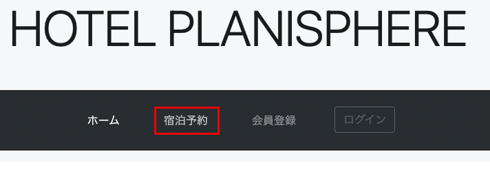
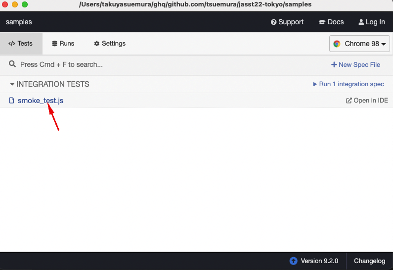
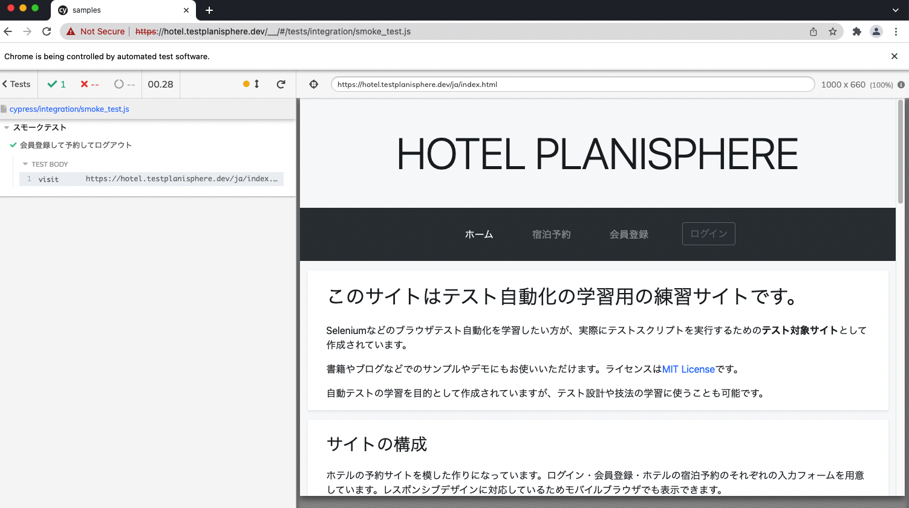
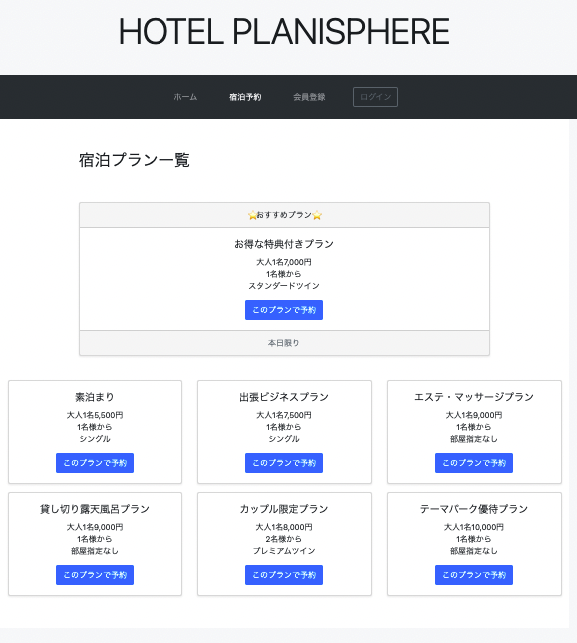
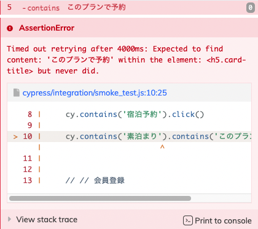
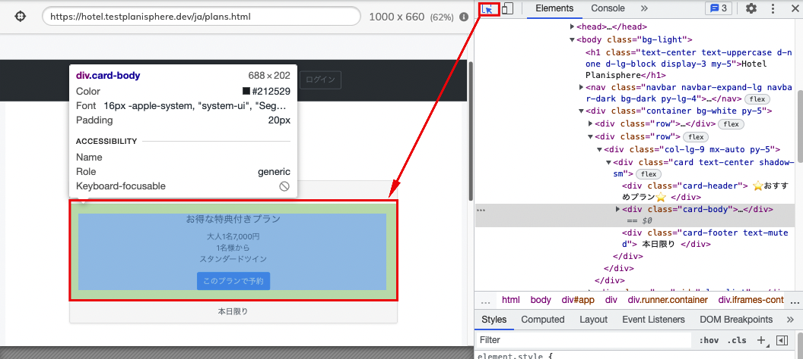
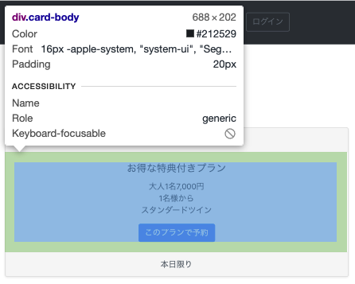
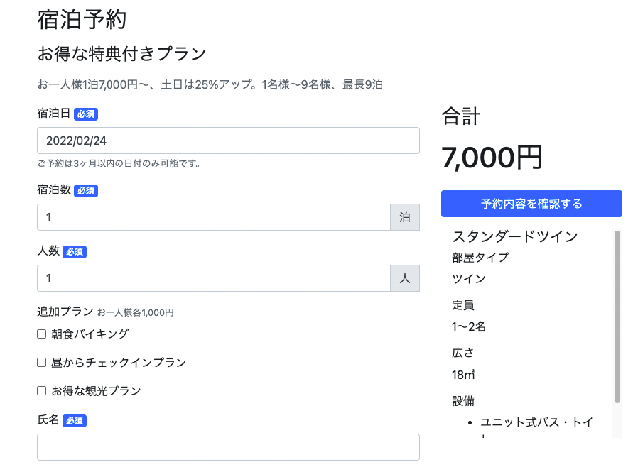
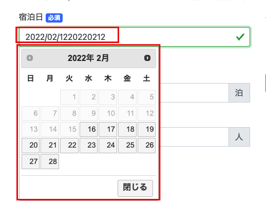

<style>

* {
  font-family: sans-serif;
}

</style>

# 60分で学ぶE2Eテスト（テスト実装編）

---

# 自己紹介：末村拓也


- Test Automation Specialist @ Autify, Inc.
- JaSST Online 実行委員

<!--
AutifyというE2Eテストのツールを作る会社に勤めています。業務外では、JaSST Onlineという別のJaSSTの実行委員をしたりしています。今日は自分の会社で作ってるツールの話はいっさいしないので、安心して聞いてください。

 -->

---

# 今日やること

- テストツール `Cypress` を使った、E2Eテスト実装の流れを紹介
- 保守性が高く読みやすいコードの書き方

コードを書くところにフォーカスします

<!--
今日は、CypressというE2Eテストツールを使って、自動テスト実装の流れを紹介していきます。
その中で、保守性が高く読みやすいコードを書くにはどうすればいいか、みたいなところにも触れたいと思います。
 -->

---

# 今日お話しできないこと

- 自動化の技術選定をどのように行うか
- 自動化やプログラミングに必要な基礎知識の説明
  - JavaScriptの文法
  - コマンドラインの使い方
- CI/CDなど、開発サイクルの中で自動テストを活かす方法

<!--
逆に、今日は技術選定とか、細かいプログラミングの知識とかはあんまり紹介できません。資料は後で公開しますので、聞いてて意味が分からなかった人は、ぜひ後でググりながらやってみてください。

同様に、CI・CDみたいな、自動テストのパワーを最大限に活かすためのツールの話も割愛させていただきます。とはいえ、このあたりの話を避けては良い自動テストは作れないので、もし話が聞きたい方がいましたらAsk the speakerで声かけてください。

 -->

---

# 準備

---

# テストに使うツール

## Cypress

デベロッパーフレンドリーなE2Eテストツール

- NodeJSで動作する（=JavaScriptで記述する）
- Chrome/Firefoxに対応
- テストコードの作成やデバッグを楽にする機能がいろいろある

---
# NodeJSのインストール

公式サイトからダウンロードしてください

https://nodejs.org/ja/

または、Macで `brew` コマンドが使える人はこちらでもOK

```bash
$ brew install node
```

---

# Cypressのインストール

コマンドラインで以下を実行

```bash
$ mkdir jasst22tokyo
$ cd jasst22tokyo
$ npm init -y
$ npm install cypress
```

---

# 起動

```bash
$ npx cypress open
```

初回起動時に設定ファイルとサンプルのテストコードが生成されます

---


---


テストを実行すると実行結果が細かく表示されます

---

# テストコードを書いてみよう

---

# テストケース

1. *非会員で予約*
2. 会員登録→予約→ログアウト
3. プレミアム会員でログイン→予約→ログアウト
4. 一般会員でログイン→予約→ログアウト
5. 一般会員の画面にプレミアム会員限定プランが表示されないこと
6. 非会員の画面に一般・プレミアム会員限定プランが表示されないこと

<!--
前の設計編で作ったテストケースを利用します。非会員で予約のテストケースを使います。

 -->

---

# 非会員で予約するシナリオの手順(1/2)

1. https://hotel.testplanisphere.dev/ja/ を開く
2. メニューから「宿泊予約」を選択
3. 宿泊プラン一覧から「お得な特典付きプラン」の「このプランで予約」を選択
4. 宿泊日を翌月1日に設定
5. 宿泊数を7泊に設定
6. 人数を2に設定
7. 朝食バイキング、昼からチェックインプラン、お得な観光プランを選択
8. 氏名に「テスト太郎」を入力
---

# 非会員で予約するシナリオの手順(2/2)


9. 確認のご連絡をメールに設定
10. メールアドレスにhoge@example.comを設定
11. ご要望・ご連絡事項に「テスト」と入力
12. 予約内容を確認するボタンを選択
13. 宿泊予約確認画面で、以下を確認
    1.  合計金額が121,000円であること
    2.  期間、人数、追加プラン、お名前、確認のご連絡、ご要望・ご連絡が入力通りになっていること
14. この内容で予約するボタンを選択し、以下を確認
    1.  予約が完了しましたダイアログが表示されること

---

# テストコードを書いてみよう

`cypress/integration/smoke_test.js` を作成

```js
describe('スモークテスト', () => {

  it('非会員で予約', () => {

    // ここにテストコードを書く

  })

})
```

`describe 〜 it` は「何をテストするのか」を書く部分

<!--
ここから実際にテストコードを書いていきましょう。プログラミング経験がまったく無い人だとちょっと馴染みのない書き方かもしれませんが、この枠組み自体はおまじないぐらいの気持ちで見てもらって大丈夫です。
describe, it, という書き方で、いわゆるテストスイートとか、テストケースに当たるようなものを定義していきます。今回は、スモークテスト、つまり「動かしても煙が出ないことを確認する」ぐらいのテストを書いて、その中に「非会員で予約」というテストケースを書いていきます。

 -->

---

設計したテスト手順をそのままコメントとして書いちゃえ

```js
describe('スモークテスト', () => {
  it('非会員で予約', () => {
    // 1. https://hotel.testplanisphere.dev/ja/ を開く
    // 2. メニューから「宿泊予約」を選択
    // 3. 宿泊プラン一覧から「お得な特典付きプラン」の「このプランで予約」を選択
    // 4. 宿泊日を翌月1日に設定
    // 5. 宿泊数を7泊に設定
    // 6. 人数を2に設定
    // 7. 朝食バイキング、昼からチェックインプラン、お得な観光プランを選択
    // 8. 氏名に「テスト太郎」を入力
    // 9. 確認のご連絡をメールに設定
    // 10. メールアドレスにhoge@example.comを設定
    // 11. ご要望・ご連絡事項に「テスト」と入力
    // 12. 予約内容を確認するボタンを選択
    // 13. 宿泊予約確認画面で、以下を確認
    //     1.  合計金額が123,000円であること
    //     2.  期間、人数、追加プラン、お名前、確認のご連絡、ご要望・ご連絡が入力通りになっていること
    // 14. この内容で予約するボタンを選択し、以下を確認
    //     1.  予約が完了しましたダイアログが表示されること
  })
})
```

<!--
テストコードを書く時、僕が良く使うテクニックなんですが、設計したテスト手順をそのままコードのコメントとして書いてしまいます。このコメントを下書きのように使って、テストコードを書いていきます。
 -->

---

# テストコードを書いてみよう

## テスト対象のサイトにアクセス

```js
describe('スモークテスト', () => {
  it('非会員で予約', () => {

    // 1. https://hotel.testplanisphere.dev/ja/ を開く
    cy.visit("https://hotel.testplanisphere.dev/ja/index.html");

  })
})
```

- コマンドは（一部の例外を除き） `cy` から始まる
- `cy.visit()` は指定したURLに移動するコマンド

<!--
では、まずはテスト対象のURLに移動するところから書いていきましょう。URLに移動するコマンドは visit です。「〜〜を開く」が「〜〜をたずねる」に変わるだけなので、かんたんですね。

 -->

---

# テストコードを書いてみよう

<div class="columns">

<div>



</div><div>

```js
describe('スモークテスト', () => {
  it('非会員で予約', () => {

    // テスト対象のサイトにアクセス
    cy.visit("https://hotel.testplanisphere.dev/ja/index.html");

    // 2. メニューから「宿泊予約」を選択  ←イマココ
    cy.■■■■■■.click()
  })
})
```

クリックは `click()` でOK
宿泊予約、というリンクを
どうやって指定する？

</div>

<!--
さて、続いて「メニューから宿泊予約を選択」のところを書いていきます。
visitと同じ要領で、なにかをクリックしたいときはclick()と書けば良いんですが、
「宿泊予約」ってボタンはどうやって指定したら良いんでしょう？

 -->

---

# テストコードを書いてみよう


<div class="columns">

<div>


</div>
<div>

Cypressでは `contains()` を使って
特定の文字を含む要素を指定できる

```js
- `宿泊予約` をクリック

↓

cy.contains('宿泊予約').click()
```


</div>
</div>

---

# 現在のテストコード

```js
describe('スモークテスト', () => {
  it('非会員で予約', () => {

    // テスト対象のサイトにアクセス
    cy.visit("https://hotel.testplanisphere.dev/ja/index.html");

    // 2. メニューから「宿泊予約」を選択
    cy.contain('宿泊予約').click()
  })
})
```

---

# 自動化は難しくない

テスト手順をそのまま1:1対応でプログラミングすれば、それがテストコード

```js

"https://hotel.testplanisphere.dev/ja/index.html" にアクセスする

↓

cy.visit("https://hotel.testplanisphere.dev/ja/index.html");

```


```js

"宿泊予約" をクリックする

↓

cy.contains('宿泊予約').click()

```

<!--
さて、ここまでの話を聞いて、難しいところってありました？ほとんど、日本語で書いたテスト手順を、そのままテストコードに出来ましたよね。
テスト自動化、難しいとかめんどくさいとか言われがちなんですが、ただ自動化するだけなら、実はテスト手順をそのまま1:1でプログラミングするだけなんですよ。なので、別に難しいことはなんにもないです。

 -->

---

# 実際に動かしてみよう


<div class="columns">
<div>

コマンドラインから以下を実行する

```js

$ npx cypress open

```
</div>
<div>


smoke_test.jsをクリック

</div>

---


ブラウザが開いて、URLに遷移できた

---

# 続けて書いていきましょう
## 宿泊プランの選択

```js
describe('スモークテスト', () => {
  it('非会員で予約', () => {

    // テスト対象のサイトにアクセス
    cy.visit("https://hotel.testplanisphere.dev/ja/index.html");

    // 2. メニューから「宿泊予約」を選択
    cy.contain('宿泊予約').click()

    // 3. 宿泊プラン一覧から「お得な特典付きプラン」の「このプランで予約」を選択 ←イマココ

  })
})
```

---

# 宿泊プランの選択

<div class="columns-center">

<div>



</div>
<div>

複数の宿泊プランから
「お得な特典付きプラン」を選択したい

</div>

<!--
ここで見てもらいたいんですが、宿泊プランの選択画面にはいくつかの宿泊プランがありますよね。その中で、「お得な特典付きプラン」というプランを選んで、なおかつその中の「このプランで予約」というのをクリックする必要があります。ただ、「このプランで予約」というボタン自体はすべての宿泊プランに存在するんですね。こういうのはどうやって書いたらいいんでしょうか？

 -->

---

# 試しに書いてみよう

`お得な特典付きプラン` を含む `宿泊プラン` の `このプランを選択` をクリックする

```js

cy.contains('お得な特典付きプラン').contains('このプランで予約').click()

```

このコードで動くかな……？ 🤔

<!--
というわけで、ここまでやってきたものの応用で、contains, contains, click というような感じでつなげて書いていきましょう。こうやってつなげて書くこと自体は出来るんですが、これで正しい要素がちゃんと取れるでしょうか？

 -->
---


# 目当ての要素が見つからない



`cy.contains('お得な特典付きプラン')` が `h5` 要素にマッチしてしまったのが原因

<!--
こちらが実際に試してみた結果なんですが、失敗してしまいましたね。条件にマッチする要素が見つかりませんでした。
エラーメッセージの中に h5 というのが見えてますでしょうか？これはHTMLタグの、見出しを表すものです。「お得な特典付きプラン」という文字を含む要素を探したら、カードの部分じゃなくて、見出しの部分にマッチしちゃったんですね。見出しの中には「このプランで予約」というボタンは無いので、ここでエラーになります。
 -->

---

# ページの構造を見てみよう

テスト結果の画面でそのまま開発者コンソールを開けます
右クリック→Inspect




---

# 探索の範囲を絞り込む

<div class="columns">
<div>



- `お得な特典付きプラン` を含む
- `宿泊プラン` の
- `このプランを選択` をクリックする

</div><div>


### やりたいこと

**お得な特典付きプラン** というテキストを含む
*カード*の取得

### 実際

**お得な特典付きプラン** というテキストを含む
*見出し* が取得された

</div>

---

# 探索の範囲を絞り込む


<div class="columns">
<div>


</div><div>

カードを表すclassは `card-body`

```js
cy.contains('div.card-body', 'お得な特典付きプラン')
  .contains('このプランで予約').click()
```

`h5` ではなく

`card-body` というclassを持つ
`div` 要素を取得するようになった

</div>

---

# 現在のテストコード

```js
describe('スモークテスト', () => {
  it('非会員で予約', () => {

    // 1. https://hotel.testplanisphere.dev/ja/ を開く
    cy.visit("https://hotel.testplanisphere.dev/ja/index.html");

    // 2. メニューから「宿泊予約」を選択
    cy.contain('宿泊予約').click()

    // 3. 宿泊プラン一覧から「お得な特典付きプラン」の「このプランで予約」を選択
    cy.contains('div.card-body', 'お得な特典付きプラン')
      .contains('このプランで予約').click()
  })
})
```

---

# 考えてみよう

## このコードは読みやすい？

```js
cy.contains('div.card-body', 'お得な')
  .contains('このプランで予約').click()
```

- `div.card-body` なんて、元のテスト設計にあったっけ？
- `div.card-body` がどのUIに対応してるか、後で思い出せる？
- ユーザーは `div.card-body` というclassを意識することがある？

---

# 😩 よくない臭いがするぞ！

テスト設計に**出てこない言葉**がテストコードに出てきたら、
テストコードからその箇所を**分離**すべきかも

---

# カスタムコマンドを追加する

`cypress/support/commands.js` に以下を追加する

```js
Cypress.Commands.add("getCardByText", (text) => {
  const selector = 'div.card-body'
  cy.contains(selector, text)
});
```

こう書けるようになった

```js
// before
cy.contains('div.card-body', 'お得な特典付きプラン')
  .contains('このプランで予約').click()

// after
cy.getCardByText('お得な特典付きプラン').contains('このプランで予約').click()
```

---

# さらに別の問題

**このプランで予約** は新しいウィンドウを開くが
Cypressは *複数ウィンドウのテストに対応していない*

---

# 新しいウィンドウを開かないようにする

```js

cy.getCardByText('お得な特典付きプラン')
  .contains('このプランで予約')
  .invoke('removeAttr', 'target')

```

リンクから「新しいウィンドウを開く」ための指定 `target="_blank"` を除く

参考: https://testersdock.com/cypress-new-window/

---

# 新たなカスタムコマンドを定義しよう

**予約プランを開く** カスタムコマンドを定義する

```js
Cypress.Commands.add("openReservationPlan", (planName) => {
  const buttonText = "このプランで予約"
  cy
    .getCardByText(planName)
    .contains(buttonText)
    .invoke("removeAttr", "target")
    .click()
})
```

テストコードはこう書ける

```js
// before
cy.getCardByText('お得な特典付きプラン').contains('このプランで予約').click()

// after
cy.openReservationPlan('お得な特典付きプラン')
```

---

# なんかめんどくさいね？

E2Eテストを書くこと自体は簡単ですが

- ツールの技術的制約の回避
- テストしづらいコンポーネントの操作

などはやっぱりめんどくさい（そしてどうしようもない）

---

# なんでわざわざ Custom Command とか使うの？

テストスクリプトから *ユーザー操作と無関係な部分* を切り離す

- 自動化の都合でやらなければいけない処理（例: 新規ウィンドウを抑制する）
- サイトの構造を表現するのに必要な記述（例: CSSセレクタ）

めんどくさい部分はどうしても出てくるので
そこを上手く隠せると読みやすいコードになる

---

# 続けて書いていきましょう

4. 宿泊日を翌月1日に設定
5. 宿泊数を7泊に設定
6. 人数を2に設定
7. 朝食バイキング、昼からチェックインプラン、お得な観光プランを選択
8. 氏名に「テスト太郎」を入力
9. 確認のご連絡をメールに設定
10. メールアドレスにhoge@example.comを設定
11. ご要望・ご連絡事項に「テスト」と入力
12. 予約内容を確認するボタンを選択

---

# 宿泊予約

<div class="columns">

<div>



</div>
<div>

フォーム入力が多い

どうやって目当てのフォームに
入力するか？

</div>

---

# HTMLのフォームの仕組みについておさらい

```html
<label for="name">お名前</label>
<input id="name" type="text" />
```


- `label` と `input` で出来ていることが多い
- `label` に `for` 属性を付けると `label` と `input` が紐付けられる
- `label` をクリックすると `input` にフォーカスが移る

---

# Cypressではどう扱われるか


```html
<label for="name">お名前</label>
<input id="name" type="text" />
```

```js
// labelが返ってくる
cy.contains("お名前")
```

`contains` で取得できる要素は厳密には `label` 要素なので
フォームに対する操作の場合、 `contains` では上手く動かない場合がある

- 普通の入力フォームへの入力はOK
- セレクトボックスやチェックボックスはNG
  - Clickableな要素として扱われない

---

# ラベルのテキストからinput要素を見つける

そんなコマンドがあったらいいのにね

```html
<label for="name">お名前</label>
<input id="name" type="text" />
```

```js
// labelが返ってくる
cy.contains("お名前")

// inputが返ってくる
cy.getByLabel("お名前")
```

---

# カスタムコマンド `getByLabel` の使用

インストール
```bash
$ npm install cypress-get-by-label
```

`cypress/support/commands.js` に以下を追加

```js
const { registerCommand } = require("cypress-get-by-label");
registerCommand();
```

---

# 宿泊予約


```js
cy.getByLabel('宿泊日').type('2022-02-12')
cy.getByLabel('宿泊数').type('7')
cy.getByLabel('人数').type('1')
cy.getByLabel('朝食バイキング').check()
cy.getByLabel('氏名').type('ジャスト 太郎')
cy.getByLabel('確認のご連絡').select('希望しない')
cy.contains('予約内容を確認する').click()
```

---

# 上手く行かなかった



- 元々入力されているテキストに**追記**してしまった
- カレンダーウィジェットが表示されたまま

---

# 対処

```js

// 「宿泊日」フィールドに入っている値を一度全て消す
cy.getByLabel('宿泊日').clear();

// 入力の後に ESC キーを押下してカレンダーウィジェットを消す
cy.getByLabel('宿泊日').type('2022/02/12{esc}');

```

---

# これもカスタムコマンドにしてしまえ

値を一度削除してから入力する `fill` メソッドを定義する

```js
Cypress.Commands.add("fill", { prevSubject: 'element' }, (subject, text) => {
  subject.clear();
  subject.type(text)
})
```

テストコードはこうなる

```js
cy.getByLabel('宿泊日').fill('2022/02/21{esc}')
```

---

# 宿泊日を翌月1日に設定

日付処理をする `dayjs` というライブラリを使う

```bash
$ npm install dayjs
```

```js
describe("スモークテスト", () => {
  const dayjs = require("dayjs");
  const checkInDate = dayjs().add(1, "month").startOf("month");

  it("会員登録して予約してログアウト", () => {

    // ...
    // 4. 宿泊日を翌月1日に設定
    cy.getByLabel("宿泊日").fill(`${checkInDate.format("YYYY/MM/DD")}{esc}`);
```

---

# この日付が表す意味を表現する

`context` はテストコードに「文脈」を与える

```js

describe("スモークテスト", () => {

  context("翌月1日から7日間予約する", () => {
    const dayjs = require("dayjs");
    const checkInDate = dayjs().add(1, "month").startOf("month");
    const checkOutDate = checkInDate.add(7, "day");

   it("会員登録して予約してログアウト", () => {

```


---

# 現在のテストコード

```js
describe("スモークテスト", () => {

  context("翌月1日から7日間予約する", () => {
    const dayjs = require("dayjs");
    const checkInDate = dayjs().add(1, "month").startOf("month");
    const checkOutDate = checkInDate.add(7, "day");

    it("会員登録して予約してログアウト", () => {
      // 1. https://hotel.testplanisphere.dev/ja/ を開く
      cy.visit("https://hotel.testplanisphere.dev/ja/index.html");

      // 2. メニューから「宿泊予約」を選択
      cy.contains("宿泊予約").click();

      // 3. 宿泊プラン一覧から「お得な特典付きプラン」の「このプランで予約」を選択
      cy.openReservationPlan("お得な特典付きプラン");

      cy.wait(1000);

      // 4. 宿泊日を翌月1日に設定
      cy.getByLabel("宿泊日").fill(`${checkInDate.format("YYYY/MM/DD")}{esc}`);

      // 5. 宿泊数を7泊に設定
      cy.getByLabel("宿泊数").fill("7");

      // 6. 人数を2に設定
      cy.getByLabel("人数").fill("2");
```
---

```js
      // 7. 朝食バイキング、昼からチェックインプラン、お得な観光プランを選択
      cy.getByLabel("朝食バイキング").check();
      cy.getByLabel("昼からチェックインプラン").check();
      cy.getByLabel("お得な観光プラン").check();

      // 8. 氏名に「テスト太郎」を入力
      cy.getByLabel("氏名").fill("テスト 太郎");

      // 9. 確認のご連絡をメールに設定
      cy.getByLabel("確認のご連絡").select("メールでのご連絡");

      // 10. メールアドレスにhoge@example.comを設定
      cy.getByLabel("メールアドレス").fill("hoge@example.com");

      // 11. ご要望・ご連絡事項に「テスト」と入力
      cy.getByLabel("ご要望・ご連絡事項等ありましたらご記入ください").fill(
        "テスト"
      );

      // 12. 予約内容を確認するボタンを選択
      cy.contains("予約内容を確認する").click();
    });
  });
});
```

---

# 予約内容の確認

13. 宿泊予約確認画面で、以下を確認
    1.  合計金額が123,000円であること
    2.  期間、人数、追加プラン、お名前、確認のご連絡、ご要望・ご連絡が入力通りになっていること
14. この内容で予約するボタンを選択し、以下を確認
    1.  予約が完了しましたダイアログが表示されること

---

# アサーション

`should` の後に条件を記述する。
この例では「合計」を含む要素が「123,000円」を含むことを確認している

```js
cy.contains("合計").should("contain", "123,000円");
```

https://docs.cypress.io/guides/references/assertions#Common-Assertions

---

# テストコード

```js
  // 13. 宿泊予約確認画面で、以下を確認
  //     1.  合計金額が123,000円であること
  //     2.  期間、人数、追加プラン、お名前、確認のご連絡、ご要望・ご連絡が入力通りになっていること
  cy.contains("合計").should("contain", "123,000円");
  cy.contains("お得な特典付きプラン");
  cy.contains("期間")
    .next()
    .should(
      "contain",
      `${checkInDate.format("YYYY年M月D日")} 〜 ${checkOutDate.format("YYYY年M月D日")} 7泊`
    );
  cy.contains("人数").next().should("contain", "2名様");
  cy.contains("追加プラン").next().should("contain", "朝食バイキング");
  cy.contains("追加プラン").next().should("contain", "昼からチェックインプラン");
  cy.contains("お名前").next().should("contain", "テスト 太郎様");
  cy.contains("追加プラン").next().should("contain", "お得な観光プラン");
  cy.contains("お名前").next().should("contain", "テスト 太郎様");
  cy.contains("確認のご連絡")next().should("contain", "メール：hoge@example.com");
  cy.contains("ご要望・ご連絡事項等").next().should("contain", "テスト");

  // 14. この内容で予約するボタンを選択し、以下を確認
  //     1.  予約が完了しましたダイアログが表示されること
  cy.contains("この内容で予約する").click();
  cy.wait(2000);
  cy.contains("予約を完了しました");
```

---

# おわりに

---

# Cypressについて

- Cypressは拡張性が高く、テストコードをきれいに記述するのに充分な機能を備えています
- 反面、複数ウィンドウを利用するサイトのテストなど、対応していないサイトのテストにはコツが要ります
- まずは触ってみて、自分のプロジェクトに適用可能か確かめてみましょう
---


# おさらい: わかりやすいテストコードを書くコツ

### **1. ユーザー目線の表記を心がける**

サイトの内部構造を使わず、表示されたテキストで選択する
### **2. あいまいな部分を減らす**

「xxの中のyy」というように指定して、要素探索の範囲を絞り込む

### **3. 「何をテストしているのか」と「どうテストするのか」を分ける**

テストコードから不要な情報を出来るだけ省いて
シンプルなコードを保つ


---

# ぜひみなさんもトライしてみてください

---

# Enjoy Testing!
