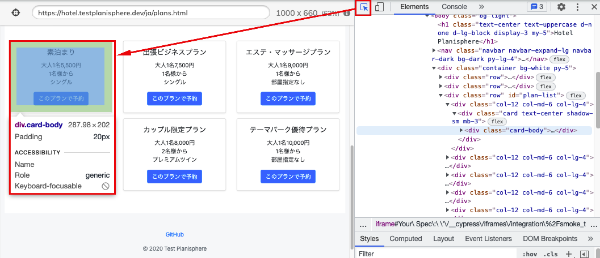

<style>

* {
  font-family: sans-serif;
}

</style>

# 60分で学ぶE2Eテスト（テスト実装編）

---

# 今日お伝えしたいこと

- テスト自動化そのものは難しくありません
- 自動化の最大の目的は、自動化を通じて **あいまいな部分をなくす** ことです
  - あいまいな部分が残っていると、不安定で読みにくいコードになります
- **ユーザー目線で書いた** E2Eテストコードは開発を助ける資産になります

*あいまいさを排除した、ユーザー目線のテストコードの書き方* をお伝えします

---

# 今日お話しできないこと

- 自動化の技術選定をどのように行うか
- 自動化やプログラミングに必要な基礎知識の説明
  - JavaScriptの文法
  - コマンドラインの使い方

---

# テストに使うツール

## Cypress

デベロッパーフレンドリーなE2Eテストツール

- NodeJSで動作する（=JavaScriptで記述する）
- Chrome/Firefoxに対応
- テストコードの作成やデバッグを楽にする機能がいろいろある

---

# 準備
## NodeJSのインストール

公式サイトからダウンロードしてください

https://nodejs.org/ja/

または、Macで `brew` コマンドが使える人はこちらでもOK

```bash
$ brew install node
```

---

# 準備
## インストール

```bash
$ mkdir jasst22tokyo
$ cd jasst22tokyo
$ npm install cypress @testing-library/cypress
```

---

# 起動

```bash
$ npx cypress open
```

初回起動時に設定ファイルとサンプルのテストコードが生成されます

---


---


テストを実行すると実行結果が細かく表示されます

---

# 早速書いていきます

- **非会員で予約**
- 会員登録→予約→ログアウト
- プレミアム会員でログイン→予約→ログアウト
- 一般会員でログイン→予約→ログアウト
- 一般会員の画面にプレミアム会員限定プランが表示されないこと
- 非会員の画面に一般・プレミアム会員限定プランが表示されないこと

---

# テスト設計はこんな感じでした

- テスト対象のサイトにアクセス
- 宿泊プランを選択
- 宿泊予約
- 予約内容の確認

---

# テストコードを書いてみよう

`smoke_test.js` を作成

```js
describe('スモークテスト', () => {
  it('非会員で予約', () => {
    // ここにテストコードを書いていきます
  })
})
```

---

# テストコードを書いてみよう

## テスト対象のサイトにアクセス

```js
describe('スモークテスト', () => {
  it('非会員で予約', () => {

    // テスト対象のサイトにアクセス
    cy.visit("https://hotel.testplanisphere.dev/ja/index.html");

  })
})
```

- コマンドは（一部の例外を除き） `cy` から始まる
- `cy.visit()` は指定したURLに移動するコマンド

---

# テストコードを書いてみよう


<div class="columns">

<div>


</div>
<div>

Cypressでは `contain()` を使って
特定の文字を含む要素を指定できる

```js
- `宿泊予約` をクリック

↓

cy.contain('宿泊予約').click()
```


</div>
</div>

---

# テストコードを書いてみよう

```js
describe('スモークテスト', () => {
  it('非会員で予約', () => {

    // テスト対象のサイトにアクセス
    cy.visit("https://hotel.testplanisphere.dev/ja/index.html");

    cy.contain('宿泊予約').click()
  })
})
```

---

# 自動化は難しくない

テスト手順をそのまま1:1対応でプログラミングすれば、それがテストコード

```js

"https://hotel.testplanisphere.dev/ja/index.html" にアクセスする

↓

cy.visit("https://hotel.testplanisphere.dev/ja/index.html");

```


```js

"宿泊予約" をクリックする

↓

cy.contains('宿泊予約').click()

```

---

# 実際に動かしてみよう


<div class="columns">
<div>

コマンドラインから以下を実行する

```js

$ npx cypress open

```
</div>
<div>


smoke_test.jsをクリック

</div>

---


ブラウザが開いて、URLに遷移できた

---

# 宿泊プランの選択

<div class="columns-center">

<div>


</div>
<div>

複数の宿泊プランから
「素泊まり」を選択したい

</div>

---

# 試しに書いてみよう

`素泊まり` を含む `宿泊プラン` の `このプランを選択` をクリックする

```js

cy.contains('素泊まり').contains('このプランで予約').click()

```

このコードで動くかな……？ 🤔

---


# 目当ての要素が見つからない


`cy.contains('素泊まり')` が `h5` 要素にマッチしてしまったのが原因

---

# ページの構造を見てみよう

テスト結果の画面でそのまま開発者コンソールを開けます
右クリック→Inspect




---

# 探索の範囲を絞り込む

<div class="columns">
<div>


- `素泊まり` を含む
- `宿泊プラン` の
- `このプランを選択` をクリックする

</div><div>


### やりたいこと

**素泊まり** というテキストを含む
*カード*の取得

### 実際

**素泊まり** というテキストを含む
*見出し* が取得された

</div>

---

# 探索の範囲を絞り込む

<div class="columns">
<div>


</div><div>

```js
cy.contains('div.card-body', '素泊まり')
  .contains('このプランで予約').click()
```

`h5` ではなく

`card-body` というclassを持つ
`div` 要素を取得するようになった

</div>

---

# 現在のテストコード

```js
describe('スモークテスト', () => {
  it('非会員で予約', () => {

    // テスト対象のサイトにアクセス
    cy.visit("https://hotel.testplanisphere.dev/ja/index.html");

    cy.contain('宿泊予約').click()

    cy.contains('div.card-body', '素泊まり')
      .contains('このプランで予約').click()
  })
})
```

---

# 考えてみよう

## このコードは読みやすい？

```js
cy.contains('div.card-body', '素泊まり')
  .contains('このプランで予約').click()
```

- `div.card-body` なんて、元のテスト設計にあったっけ？
- `div.card-body` がどのUIに対応してるか、後で思い出せる？
- ユーザーは `div.card-body` というclassを意識することがある？

---

# 😩 よくない臭いがするぞ！

テスト設計に**出てこない言葉**がテストコードに出てきたら、
テストコードからその箇所を**分離**すべきかも

---

# カスタムコマンドを追加する

`cypress/support/commands.js` に以下を追加する

```js
Cypress.Commands.add("getCardByText", (text) => {
  const selector = 'div.card-body'
  cy.contains(selector, text)
});
```

こう書けるようになった

```js
// before
cy.contains('div.card-body', '素泊まり')
  .contains('このプランで予約').click()

// after
cy.getCardByText('素泊まり').contains('このプランで予約').click()
```

---

# さらに別の問題

**このプランで予約** は新しいウィンドウを開くが
Cypressは *複数ウィンドウのテストに対応していない*

---

# 新しいウィンドウを開かないようにする

```js

cy.getCardByText('素泊まり')
  .contains('このプランで予約')
  .invoke('removeAttr', 'target')

```

リンクから「新しいウィンドウを開く」ための指定 `target="_blank"` を除く

参考: https://testersdock.com/cypress-new-window/

---

# 新たなカスタムコマンドを定義しよう

**予約プランを開く** カスタムコマンドを定義する

```js
Cypress.Commands.add("openReservationPlan", (planName) => {
  const buttonText = "このプランで予約"
  cy
    .getCardByText(planName)
    .contains(buttonText)
    .invoke("removeAttr", "target")
    .click()
})
```

テストコードはこう書ける

```js
// before
cy.getCardByText('素泊まり').contains('このプランで予約').click()

// after
cy.openReservationPlan('素泊まり')
```

---

# なんかめんどくさいね？

E2Eテストを書くこと自体は簡単ですが

- ツールの技術的制約の回避
- テストしづらいコンポーネントの操作

などはやっぱりめんどくさい（そしてどうしようもない）

---

# なんでわざわざ Custom Command とか使うの？

テストスクリプトから *ユーザー操作と無関係な部分* を切り離す

- 自動化の都合でやらなければいけない処理（例: 新規ウィンドウを抑制する）
- サイトの構造を表現するのに必要な記述（例: CSSセレクタ）

めんどくさい部分はどうしても出てくるので
そこを上手く隠せると読みやすいコードになる

---

# 続けて書いていきましょう

- テスト対象のサイトにアクセス
- 宿泊プランを選択
- *宿泊予約*
- *予約内容の確認*

---

# 宿泊予約

<div class="columns">

<div>


</div>
<div>

フォーム入力が多い

どうやって目当てのフォームに
入力するか？

</div>

---

# HTMLのフォームの仕組みについておさらい

```html
<label for="name">お名前</label>
<input id="name" type="text" />
```


- `label` と `input` で出来ていることが多い
- `label` に `for` 属性を付けると `label` と `input` が紐付けられる
- `label` をクリックすると `input` にフォーカスが移る

---

# Cypressではどう扱われるか

`contains` で取得できる要素は厳密には `label` 要素なので
フォームに対する操作の場合、 `contains` では上手く動かない場合がある

- 普通の入力フォームへの入力はOK
- セレクトボックスやチェックボックスはNG
  - Clickableな要素として扱われない

---

# ラベルのテキストからinput要素を見つける

そんなコマンドがあったらいいのにね

```html
<label for="name">お名前</label>
<input id="name" type="text" />
```

```js

// labelが返ってくる
cy.contains("お名前")

// inputが返ってくる
cy.getByLabel("お名前")

```

---

# カスタムコマンド `getByLabel` の使用

インストール
```bash
$ npm i -D cypress-get-by-label
```

`cypress/support/commands.js` に以下を追加

```js
const { registerCommand } = require("cypress-get-by-label");
registerCommand();
```

---

# 宿泊予約


```js
cy.getByLabel('宿泊日').type('2022-02-12')
cy.getByLabel('宿泊数').type('7')
cy.getByLabel('人数').type('1')
cy.getByLabel('朝食バイキング').check()
cy.getByLabel('氏名').type('ジャスト 太郎')
cy.getByLabel('確認のご連絡').select('希望しない')
cy.contains('予約内容を確認する').click()
```

---

# 上手く行かなかった


- 元々入力されているテキストに**追記**してしまった
- カレンダーウィジェットが表示されたまま

---

# 対処

```js

// 「宿泊日」フィールドに入っている値を一度全て消す
cy.getByLabel('宿泊日').type('{selectall}{backspace}')

// 入力の後に ESC キーを押下してカレンダーウィジェットを消す
cy.getByLabel('宿泊日').type('2022/02/12{esc}')

```


---

# これもカスタムコマンドにしてしまえ

値を一度削除してから入力する `fill` メソッドを定義する

```js
Cypress.Commands.add("fill", { prevSubject: 'element' }, (subject, text) => {
  subject.type("{selectall}{backspace}");
  subject(text)
})
```

テストコードはこうなる

```js
cy.getByLabel('宿泊日').fill('2022/02/21{esc}')
```

---

# 予約内容の確認

詳しくはセッションで！

---

# いかがでしたか

- Cypressは拡張性が高く、テストコードをきれいに記述するのに充分な機能を備えています
- 反面、複数ウィンドウを利用するサイトのテストなど、対応していないサイトのテストにはコツが要ります
- まずは触ってみて、自分のプロジェクトに適用可能か確かめてみましょう
---


# おさらい: わかりやすいテストコードを書くコツ

## ユーザー目線の表記を心がける

サイトの内部構造を使わず、表示されたテキストで選択する
## あいまいな部分を減らす

「xxの中のyy」というように指定して、要素探索の範囲を絞り込む

## 「何をテストしているのか」と「どうテストするのか」を分ける

カスタムコマンドを上手く使って、
処理やUIコンポーネントに名前を付ける


