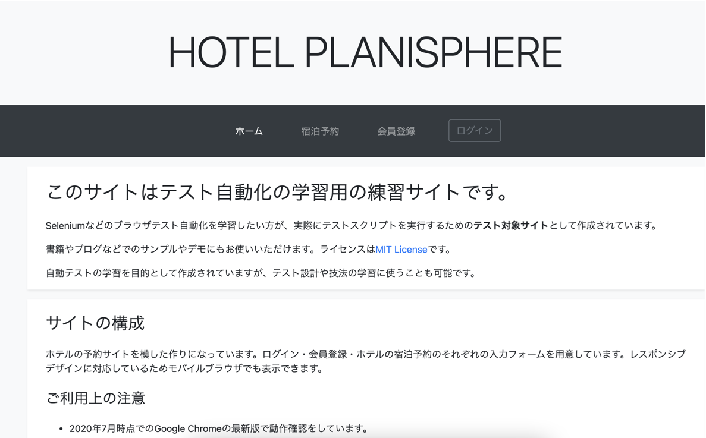
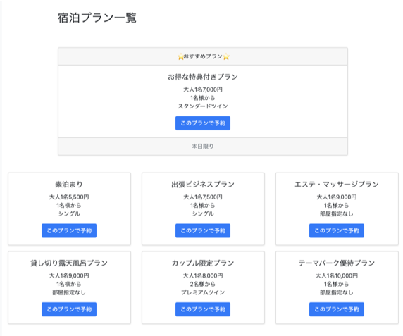
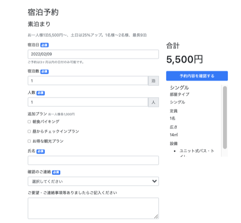
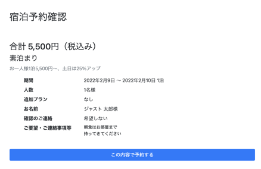
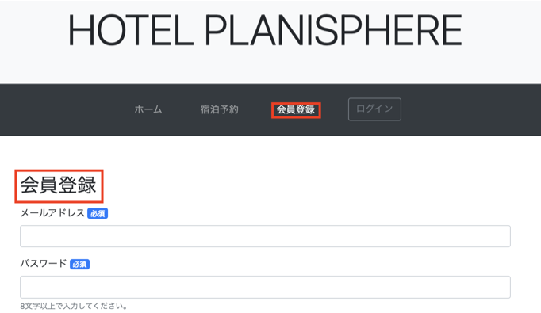
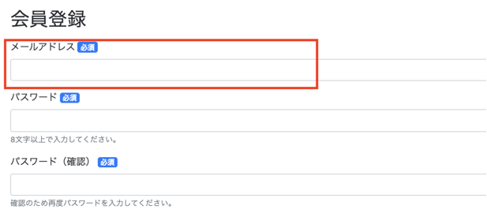
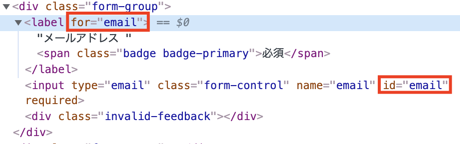
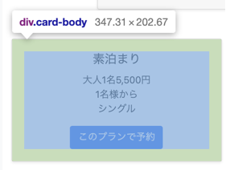

<style>

* {
  font-family: sans-serif;
}

</style>

# 60分で学ぶE2Eテスト（実践編）

---

# 今日お伝えしたいこと

- テスト自動化そのものは難しくありません
- 自動化の最大の目的は、自動化を通じて **あいまいな部分をなくす** ことです
  - あいまいな部分が残っていると、不安定で読みにくいコードになります
- **ユーザー目線で書いた** E2Eテストコードは開発を助ける資産になります

*あいまいさを排除した、ユーザー目線のテストコードの書き方* をお伝えします

---

# 今日お話しできないこと

- 自動化の技術選定をどのように行うか
- 自動化やプログラミングに必要な基礎知識の説明
  - JavaScriptの文法
  - コマンドラインの使い方

スライドのおわりにおまけを付けておきます
（予稿集のおわりにもあります）

---

# テストに使うツール

## Cypress

デベロッパーフレンドリーなE2Eテストツール

- NodeJSで動作する（=JavaScriptで記述する）
- Chrome/Firefoxに対応
- テストコードの作成やデバッグを楽にする機能がいろいろある

---

# 準備
## NodeJSのインストール

Macの場合は以下

```bash
$ brew install node
```

---

# 準備
## インストール

```bash
$ mkdir jasst22tokyo
$ cd jasst22tokyo
$ npm install cypress @testing-library/cypress
```

---

# 起動

```bash
$ npx cypress open
```

初回起動時に設定ファイルとサンプルのテストコードが生成されます

---


---


テストを実行すると実行結果が細かく表示されます

---

# 早速書いていきます

テストシナリオ

- **会員登録して予約してログアウト**
- プレミアム会員でログインして予約してログアウト
- 一般会員でログインして予約してログアウト
  - 一般会員の画面でプレミアム会員向けプランが出ていないことをテスト

---

# まずはステップを書き起こす

- テスト対象のサイトにアクセス
- 会員登録
- 宿泊プランを選択
- 宿泊予約
- 予約内容の確認
- ログアウト

---

# まずはステップを書き起こす

<div class="columns">
<div>

## テスト対象のサイトにアクセス

```js
- `https://hotel.testplanisphere.dev/ja/`
   にアクセス
```

</div>
<div>



</div>

---

# まずはステップを書き起こす

<div class="columns">

<div>

## 会員登録

```js
- `会員登録` をクリック
- `メールアドレス` に `jasst21@example.com` と入力
- `パスワード` に `P@ssw0rd` と入力
- `パスワード（確認）` に `P@ssw0rd` と入力
- `氏名` に `ジャスト 太郎` と入力
- `住所` に `東京都千代田区千代田1-1-1` と入力
- `電話番号` に `090-0000-0000` と入力
- `性別` に `その他` と入力
- `生年月日` に `1987/03/16` と入力
- `お知らせを受け取る` に チェックを入れる
```

</div>
<div>


</div>
</div>

---

# まずはステップを書き起こす

<div class="columns">

<div>

## 宿泊プランの選択

```js
- `宿泊予約` をクリック
- `このプランで予約` をクリック
```

</div>
<div>



</div>

---

# まずはステップを書き起こす

<div class="columns">

<div>

## 宿泊予約

```js
- `宿泊日` に `2022/03/16` を入力
- `宿泊数` に `3` と入力
- `人数` に `2` と入力
- `朝食バイキング` にチェックを入れる
- `氏名` が `ジャスト 太郎` であることを確認
- `確認のご連絡` に `メールでのご連絡` を選択
- `ご要望・ご連絡事項等ありましたらご記入ください` に
  `朝食はお部屋まで\n持ってきてください` と入力
- `予約内容を確認する` をクリック
```

</div>
<div>



</div>
</div>

---

# まずはステップを書き起こす

<div class="columns">

<div>

## 予約内容の確認

```js
- `合計 5,500円（税込み）` と表示されていることを確認
- `素泊まり` と表示されていることを確認
- `期間` に `2022年2月9日 〜 2022年2月10日 1泊` と
  表示されていることを確認
- `人数` に `1名様` と表示されていることを確認
- `追加プラン` に `なし` と表示されていることを確認
- `人数` に `1名様` と表示されていることを確認
- `お名前` に `ジャスト 太郎` と表示されていることを確認
- `確認のご連絡` に `希望しない` と表示されていることを確認
- `ご要望・ご連絡事項等` に
  `朝食はお部屋まで\n持ってきてください` と
  表示されていることを確認
- `この内容で予約する` をクリック
- `予約を完了しました` と
  表示されていることを確認
- `閉じる` をクリック
```

</div>
<div>



</div>

---

# まずはステップを書き起こす

## ログアウト

```js
- `ログアウト` をクリック
- `ログアウト` が表示されていないことを確認
- `ログイン` が表示されていることを確認
```

---

自動化コードは、
ほとんどこれらのステップをそのままプログラミングしたものになる

```js

// `ログアウト` をクリック
cy.contains('ログアウト').click()

```

逆に言えば、そのままプログラミングできないところを、
どうわかりやすく書けるかが鍵になる

---

# テストコードを書いてみよう

`smoke_test.js` を作成

```js
describe('スモークテスト', () => {
  it('会員登録して予約してログアウト', () => {
    // ここにテストコードを書いていきます
  })
})
```

---

# テストコードを書いてみよう

## テスト対象のサイトにアクセス

```js
cy.visit("https://hotel.testplanisphere.dev/ja/index.html");
```

ここは簡単ですね

---

# テストコードを書いてみよう


<div class="columns">

<div>

## 会員登録画面に遷移

```js
- `会員登録` をクリック
```

</div>
<div>

Cypressでは `contain()` を使って
特定の文字を含む要素を指定できる

```js
cy.contain('会員登録').click()
```


</div>
</div>

---

## あいまいな指定を減らす

<div class="columns">
<div>



</div>
<div>

```js
- `会員登録` をクリック
```

- 「会員登録」という文字は2箇所
- どちらをクリックする？

</div>
</div>

---

# あいまいな指定を減らす

1. サイトの構造を使う
   1. *`メニューバー` の中の* `会員登録` をクリック
2. 要素のセマンティクスを使う
   1. `会員登録` *リンク* をクリック

---

# サイトの構造を使ってテストを書く

`within` を使うと、「xxの中のyy」という構造を表現できる

```js
within('nav', () => {
  cy.contain('会員登録').click
})
```

---

# こう書くのは良くない

href属性を使う
```js
cy.get('a[href="./signup.html"])
```

class属性を使う
```js
cy.get('a.nav-link)
```

---

# 要素探索のアンチパターン: 内部属性を用いる

- `href` や `class` はサイトの内部で使われている属性
- ユーザーはこれらを使って要素を **探さない**
- ユーザーにとって無関係なものを使わないのがE2Eテストにおける鉄則
- 代わりに **セマンティックタグ / 文言 / 構造** などを用いる

※セマンティックタグ: `a` `nav` など、文書の中で特定の意味を持つタグ
逆に `div` や `span` などは意味を持たないタグとして扱われる

---

# 同じ要領でフォーム入力



原則に則れば、「メールアドレスラベルを持つ入力フォーム」を探したいが……

---

# 同じ要領でフォーム入力



ラベルは `for` 属性に指定された `id` を持つ `input` と紐付けられる

---

# Custom Command を利用する

label から input を取得するのはとても一般的なテクニックですが
Cypress標準では出来ません

cypress-get-by-label という Custom Command をインストールします

https://www.npmjs.com/package/cypress-get-by-label


---

# cypress-get-by-label のインストール

```bash
$ npm i -D cypress-get-by-label
```

`cypress/support/commands.js` に以下を記述

---

## こう書けるようになる

```js
cy.getByLabel('メールアドレス').type('jasst21@example.com')
```
---

## 続けて書いていきましょう

```js

cy.getByLabel('メールアドレス').type('jasst21@example.com')
cy.getByLabel(`パスワード`).type(`P@ssw0rd`)
cy.getByLabel(`パスワード（確認）`).type(`P@ssw0rd`)
cy.getByLabel(`氏名`).type(`ジャスト 太郎`)
cy.getByLabel(`住所`).type(`東京都千代田区千代田1-1-1`)
cy.getByLabel(`電話番号`).type(`09000000000`)
cy.getByLabel(`性別`).select(`その他`)
cy.getByLabel(`生年月日`).type(`1987-03-16`)
cy.getByLabel(`お知らせを受け取る`).click()
cy.contains('登録').click()

```
---

# 操作対象をFormの中に限定しましょう

```js

cy.get('form').within(()=> {
  cy.getByLabel('メールアドレス').type('jasst21@example.com')
  cy.getByLabel(`パスワード`).type(`P@ssw0rd`)
  cy.getByLabel(`パスワード（確認）`).type(`P@ssw0rd`)
  cy.getByLabel(`氏名`).type(`ジャスト 太郎`)
  cy.getByLabel(`住所`).type(`東京都千代田区千代田1-1-1`)
  cy.getByLabel(`電話番号`).type(`09000000000`)
  cy.getByLabel(`性別`).select(`その他`)
  cy.getByLabel(`生年月日`).type(`1987-03-16`)
  cy.getByLabel(`お知らせを受け取る`).click()
  cy.contains('登録').click()
})

```

限定しないと、最後の `cy.contains('登録')` で
`会員登録` というリンクをクリックしてしまいます

---

# ここまでのコード

```js
describe('スモークテスト', () => {
  it('会員登録して予約してログアウト', () => {
    // テスト対象のサイトにアクセス
    cy.visit("https://hotel.testplanisphere.dev/ja/index.html");

    // 会員登録
    cy.get('nav').within(() => {
      cy.contains('会員登録').click()
    })
    cy.get("form").within(() => {
      cy.getByLabel("メールアドレス").type("jasst21@example.com");
      cy.getByLabel(`パスワード`).type(`P@ssw0rd`);
      cy.getByLabel(`パスワード（確認）`).type(`P@ssw0rd`);
      cy.getByLabel(`氏名`).type(`ジャスト 太郎`);
      cy.getByLabel(`住所`).type(`東京都千代田区千代田1-1-1`);
      cy.getByLabel(`電話番号`).type(`09000000000`);
      cy.getByLabel(`性別`).select(`その他`);
      cy.getByLabel(`生年月日`).type(`1987-03-16`);
      cy.getByLabel(`お知らせを受け取る`).click();
      cy.contains("登録").click();
    });

    // 宿泊プランを選択
    // 宿泊予約
    // 予約内容を確認
    // ログアウト

  })
})

```

---

# 続きを書いていきます

```js
- `宿泊予約` をクリック
- `このプランで予約` をクリック
```

考えてみよう

- 「宿泊予約」というリンクはページのどこにあるのか？
- 「このプランで予約」というボタンはページのどこにあるのか？
- どのプランを予約すべきか？

---

# こうあるべき

```js
- `メニューバー` の `宿泊予約` をクリック
- `素泊まり` を含む `宿泊プラン` の `このプランで予約` をクリック
```

テストコードはこう書ける

```js
cy.get('nav').within(() => {
  cy.contains('宿泊予約').click()
})
cy.get('div.card-body').contains('素泊まり').within(() => {
  cy.contains('このプランで予約').click()
})
```

しかし、 後者の例はちょっと良くなさそう…… 🤔

---

# テストしにくい要素



このコンポーネントは `div.card-body` というセレクタで取れるが

- `div` はセマンティックなタグではない
- `card-body` というクラスはデザインの変更で変わりうる

どちらも不安定さをもたらす

---

# テストしにくい要素に出会ったら

- テストしやすいようにアプリケーション側を修正する
- テストコード側で工夫する

---

# コンポーネントを抽象化する

このコンポーネントを `card` と名付けて、テストコード間で再利用する
もしアプリケーション側が変更されても修正箇所は1箇所で済む

---

# Custom Command の定義

`cypress/support/commands.js` に以下を追記する

```js
Cypress.Commands.add("getCardByText", (text) => {
  const selector = 'div.card-body'
  cy.contains(selector, text)
});
```

---

こう書けるようになった

```js
cy.getCardByText('素泊まり').within(() => {
  cy.contains('このプランで予約').click()
})
```

`card` のスタイルが変わっても、一箇所修正するだけでOKになった

---


---

おまけ

---


# 利用する技術の選定

いくつか軸があります

---

# 利用する技術の選定

## クロスブラウザ・クロスデバイスはどのぐらい必要？

やるやら | フレームワーク
---|---
いらない | Cypress
いる | PlayWright
超いる | Selenium

---
### 参考: クロスブラウザ・クロスデバイスについて

- 「いろんなブラウザでテスト出来たほうがいいじゃん」と思ってしまうのが人の常
- 実際は自動テストを使おうが使わまいがクロスブラウザ対応はしんどい
  - IE対応が辛いのはテストが辛いからじゃない、IEが辛いからだ
  - **おまえは本当にIEについて良く理解しながらIEに対応しているのか？**
- クロスブラウザテストできる ≠ クロスブラウザテストが **期待通り** 動く
  - 自動化レイヤーのバグを踏むことも多い
- nice to have でクロスブラウザに手を出さないこと
  - お兄さんとの約束だよ

---

# 利用する技術の選定

## テストコードを読むのは開発者だけか？

- 開発者だけ → 普通のテストツールで良い
- チームみんなで読む → BDD系のツールを使う

---
### 参考: BDD (Behavior Driven Development)

- 自然言語でプロダクトの **振る舞い** を記述するためのツール
  - 独自の **自然言語っぽい** 記述を使うもの
  - Markdown を使うもの
- チーム全体でプロダクトの振る舞いを考えて、それを自動化するためのもの
- ノーコードのツールとは違う
  - プログラミング不要でテスト自動化できるツールは志向していない
- 今日はこの話はしません
  - が、ここはここで *かなりアツい* 領域……
  - この話がしたいひとは後で声かけてください

---

今回は

**クロスブラウザは割り切る** し、

**テストコードは開発者がメンテする** ということで、

*Cypress* にします

