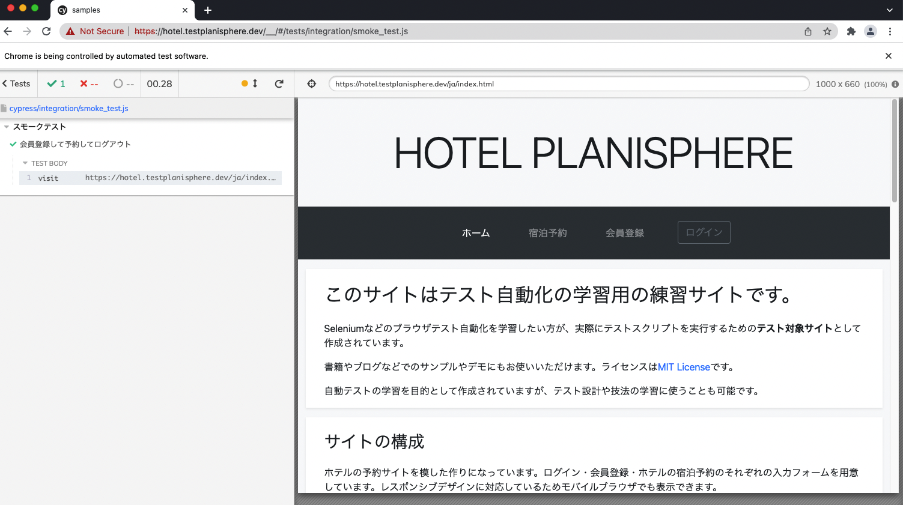
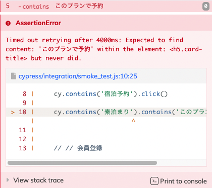

<style>

* {
  font-family: sans-serif;
}

</style>

# 60分で学ぶE2Eテスト（実践編）

---

# 今日お伝えしたいこと

- テスト自動化そのものは難しくありません
- 自動化の最大の目的は、自動化を通じて **あいまいな部分をなくす** ことです
  - あいまいな部分が残っていると、不安定で読みにくいコードになります
- **ユーザー目線で書いた** E2Eテストコードは開発を助ける資産になります

*あいまいさを排除した、ユーザー目線のテストコードの書き方* をお伝えします

---

# 今日お話しできないこと

- 自動化の技術選定をどのように行うか
- 自動化やプログラミングに必要な基礎知識の説明
  - JavaScriptの文法
  - コマンドラインの使い方

スライドのおわりにおまけを付けておきます
（予稿集のおわりにもあります）

---

# テストに使うツール

## Cypress

デベロッパーフレンドリーなE2Eテストツール

- NodeJSで動作する（=JavaScriptで記述する）
- Chrome/Firefoxに対応
- テストコードの作成やデバッグを楽にする機能がいろいろある

---

# 準備
## NodeJSのインストール

Macの場合は以下

```bash
$ brew install node
```

---

# 準備
## インストール

```bash
$ mkdir jasst22tokyo
$ cd jasst22tokyo
$ npm install cypress @testing-library/cypress
```

---

# 起動

```bash
$ npx cypress open
```

初回起動時に設定ファイルとサンプルのテストコードが生成されます

---


---


テストを実行すると実行結果が細かく表示されます

---

# 早速書いていきます

- **非会員で予約**
- 会員登録→予約→ログアウト
- プレミアム会員でログイン→予約→ログアウト
- 一般会員でログイン→予約→ログアウト
- 一般会員の画面にプレミアム会員限定プランが表示されないこと
- 非会員の画面に一般・プレミアム会員限定プランが表示されないこと

---

# テスト設計はこんな感じでした

- テスト対象のサイトにアクセス
- 宿泊プランを選択
- 宿泊予約
- 予約内容の確認

---

# テストコードを書いてみよう

`smoke_test.js` を作成

```js
describe('スモークテスト', () => {
  it('非会員で予約', () => {
    // ここにテストコードを書いていきます
  })
})
```

---

# テストコードを書いてみよう

## テスト対象のサイトにアクセス

```js
describe('スモークテスト', () => {
  it('非会員で予約', () => {

    // テスト対象のサイトにアクセス
    cy.visit("https://hotel.testplanisphere.dev/ja/index.html");

  })
})
```

- コマンドは（一部の例外を除き） `cy` から始まる
- `cy.visit()` は指定したURLに移動するコマンド

---

# テストコードを書いてみよう


<div class="columns">

<div>

## 宿泊予約サイトにアクセス

```js
- `宿泊予約` をクリック
```

</div>
<div>

Cypressでは `contain()` を使って
特定の文字を含む要素を指定できる

```js
cy.contain('宿泊予約').click()
```


</div>
</div>

---

# テストコードを書いてみよう

## 宿泊予約サイトにアクセス

```js
describe('スモークテスト', () => {
  it('非会員で予約', () => {

    // テスト対象のサイトにアクセス
    cy.visit("https://hotel.testplanisphere.dev/ja/index.html");

    cy.contain('宿泊予約').click()
  })
})
```

---

# 自動化は難しくない

テスト手順をそのまま1:1対応でプログラミングすれば、それがテストコード

```js

"https://hotel.testplanisphere.dev/ja/index.html" にアクセスする

↓

cy.visit("https://hotel.testplanisphere.dev/ja/index.html");

```


```js

"宿泊予約" をクリックする

↓

cy.contains('宿泊予約').click()

```

---

# 実際に動かしてみよう


<div class="columns">
<div>

コマンドラインから以下を実行する

```js

$ npx cypress open

```
</div>
<div>


smoke_test.jsをクリック
</div>

---


ブラウザが開いて、URLに遷移できた

---

# 宿泊プランの選択

<div class="columns-center">

<div>


</div>
<div>

複数の宿泊プランから
「素泊まり」を選択したい

</div>

---

# 込み入った処理を表現する

`素泊まり` を含む `宿泊プラン` の `このプランを選択` をクリックする

```js

cy.contains('素泊まり').contains('このプランで予約').click()

```

このコードで動くかな……？ 🤔

---


# 目当ての要素が見つからない



`cy.contains('素泊まり')` が `h5` 要素にマッチしてしまったのが原因

---

# 探索の範囲を絞り込む

<div class="columns">
<div>


</div><div>

### やりたいこと

**素泊まり** というテキストを含む
*カード*の取得

### 実際

**素泊まり** というテキストを含む
*見出し* が取得された

---

# 探索の範囲を絞り込む

<div class="columns">
<div>


</div><div>

```js
cy.contains('div.card-body', '素泊まり')
  .contains('このプランで予約').click()
```

`h5` ではなく

`card-body` というclassを持つ
`div` 要素を取得するようになった

</div>

---

# 現在のテストコード

```js
describe('スモークテスト', () => {
  it('非会員で予約', () => {

    // テスト対象のサイトにアクセス
    cy.visit("https://hotel.testplanisphere.dev/ja/index.html");

    cy.contain('宿泊予約').click()

    cy.contains('div.card-body', '素泊まり')
      .contains('このプランで予約').click()
  })
})
```

---

# 考えてみよう

## このコードは読みやすい？

```js
cy.contains('div.card-body', '素泊まり')
  .contains('このプランで予約').click()
```

- `div.card-body` なんて、元のテスト設計にあったっけ？
- `div.card-body` がどのUIに対応してるか、後で思い出せる？

---

# 😩 よくない臭いがするぞ！

テスト設計に**出てこない言葉**がテストコードに出てきたら、
テストコードからその箇所を**分離**すべきかも

---

# カスタムコマンドを追加する

`cypress/support/commands.js` に以下を追加する

```js
Cypress.Commands.add("getCardByText", (text) => {
  const selector = 'div.card-body'
  cy.contains(selector, text)
});
```

こう書けるようになった

```js
// before
cy.contains('div.card-body', '素泊まり')
  .contains('このプランで予約').click()

// after
cy.getCardByText('素泊まり').contains('このプランで予約').click()
```

---

# さらに別の問題

**このプランで予約** は新しいウィンドウを開くが
Cypressは *複数ウィンドウのテストに対応していない*

---

# 新しいウィンドウを開かないようにする

```js

cy.getCardByText('素泊まり')
  .contains('このプランで予約')
  .invoke('removeAttr', 'target')

```

リンクから「新しいウィンドウを開く」ための指定 `target="_blank"` を除く

参考: https://testersdock.com/cypress-new-window/

---

# 新たなカスタムコマンドを定義しよう

**予約プランを開く** カスタムコマンドを定義する

```js
Cypress.Commands.add("openReservationPlan", (planName) => {
  const buttonText = "このプランで予約"
  cy
    .getCardByText(planName)
    .contains(buttonText)
    .invoke("removeAttr", "target")
    .click()
})
```

テストコードはこう書ける

```js
// before
cy.getCardByText('素泊まり').contains('このプランで予約').click()

// after
cy.openReservationPlan('素泊まり')
```

---

# なんかめんどくさいね？

E2Eテストを書くこと自体は簡単ですが

- ツールの技術的制約の回避
- テストしづらいコンポーネントの操作

などはやっぱりめんどくさい（そしてどうしようもない）

---

# なんでわざわざ Custom Command とか使うの？

テストスクリプトから *ユーザー操作と無関係な部分* を切り離す

- 可読性の向上
- ポータビリティの向上

めんどくさい部分はどうしても出てくるので
そこを上手く隠せると読みやすいコードになる

---

# 続けて書いていきましょう

- テスト対象のサイトにアクセス
- 宿泊プランを選択
- *宿泊予約*
- *予約内容の確認*

---

# その前に

フォームに対する操作の場合、 `contains` では上手く動かない場合がある

- 普通の入力フォームであればOK
- セレクトボックスやチェックボックスはNG

`contains` で取得できる要素は厳密には `label` 要素なので上手く取得できないかも

---

# 宿泊予約


```js
cy.getByLabel('宿泊日').type('2022-02-12')
cy.getByLabel('宿泊数').type('7')
cy.getByLabel('人数').type('1')
cy.getByLabel('朝食バイキング').check()
cy.getByLabel('氏名').type('ジャスト 太郎')
cy.getByLabel('確認のご連絡').select('希望しない')
cy.contains('予約内容を確認する').click()
```

---

# 上手く行かなかった


- 元々入力されているテキストに追記してしまった
- カレンダーウィジェットが表示されたまま

---

# 対処

```js

// 「宿泊日」フィールドに入っている値を一度全て消す
cy.getByLabel('宿泊日').type('{selectall}{backspace}')

// 入力の後に ESC キーを押下してカレンダーウィジェットを消す
cy.getByLabel('宿泊日').type('2022/02/12{esc}')

```

---

# これもカスタムコマンドにしてしまえ

値を一度削除してから入力する `fill` メソッドを定義する

```js
Cypress.Commands.add("fill", { prevSubject: 'element' }, (subject, text) => {
  subject.type("{selectall}{backspace}");
  subject(text)
})
```

テストコードはこうなる

```js
cy.getByLabel('宿泊日').fill('2022/02/21{esc}')
```

---

# 予約内容の確認

TBD

---

# いかがでしたか

- Cypressは拡張性が高く、テストコードをきれいに記述するのに充分な機能を備えています
- 反面、複数ウィンドウを利用するサイトのテストなど、対応していないサイトのテストにはコツが要ります
- まずは触ってみて、自分のプロジェクトに適用可能か確かめてみましょう
---


# おさらい: わかりやすいテストコードを書くコツ

## ユーザー目線の表記を心がける

サイトの内部構造を使わず、表示されたテキストで選択する
## あいまいな部分を減らす

「xxの中のyy」というように指定して、要素探索の範囲を絞り込む

## 「何をテストしているのか」と「どうテストするのか」を分ける

カスタムコマンドを上手く使って、
処理やUIコンポーネントに名前を付ける


---


おまけ

---


# 利用する技術の選定

いくつか軸があります

---

# 利用する技術の選定

## クロスブラウザ・クロスデバイスはどのぐらい必要？

やるやら | フレームワーク
---|---
いらない | Cypress
いる | PlayWright
超いる | Selenium

---
### 参考: クロスブラウザ・クロスデバイスについて

- 「いろんなブラウザでテスト出来たほうがいいじゃん」と思ってしまうのが人の常
- 実際は自動テストを使おうが使わまいがクロスブラウザ対応はしんどい
  - IE対応が辛いのはテストが辛いからじゃない、IEが辛いからだ
  - **おまえは本当にIEについて良く理解しながらIEに対応しているのか？**
- クロスブラウザテストできる ≠ クロスブラウザテストが **期待通り** 動く
  - 自動化レイヤーのバグを踏むことも多い
- nice to have でクロスブラウザに手を出さないこと
  - お兄さんとの約束だよ

---

# 利用する技術の選定

## テストコードを読むのは開発者だけか？

- 開発者だけ → 普通のテストツールで良い
- チームみんなで読む → BDD系のツールを使う

---
### 参考: BDD (Behavior Driven Development)

- 自然言語でプロダクトの **振る舞い** を記述するためのツール
  - 独自の **自然言語っぽい** 記述を使うもの
  - Markdown を使うもの
- チーム全体でプロダクトの振る舞いを考えて、それを自動化するためのもの
- ノーコードのツールとは違う
  - プログラミング不要でテスト自動化できるツールは志向していない
- 今日はこの話はしません
  - が、ここはここで *かなりアツい* 領域……
  - この話がしたいひとは後で声かけてください

---

今回は

**クロスブラウザは割り切る** し、

**テストコードは開発者がメンテする** ということで、

*Cypress* にします

